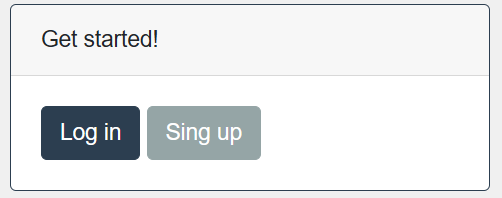
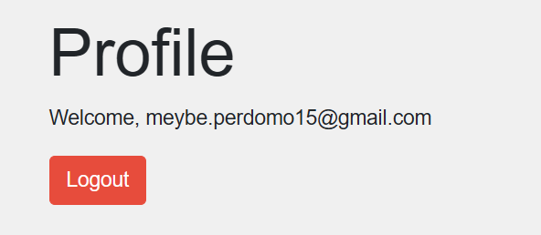

# Flask MongoDB Authentication

Este proyecto es una aplicación web básica construida con Flask que proporciona funcionalidades de autenticación de usuarios utilizando MongoDB como base de datos.


 

 

## Características

- Registro de usuarios con verificación de correo electrónico único.
- Inicio de sesión seguro con almacenamiento de contraseñas en forma de hash.
- Visualización de perfiles de usuario.
- Cierre de sesión seguro.


## Requisitos
- Python 3.x
- Flask
- pymongo
- MongoDB
## Instalación

1.Clona este repositorio en tu máquina local:

```bash
  https://github.com/Meybe-1in/login.git
  cd login
```
2. Crea y activa un enviroment:

```bash 
 python -m venv env 
                                            
```
```bash 
env\Scripts\activate                                             
```
3. Instala las dependencias necesarias:

```bash 
pip install Flask pymongo  

```

4. Configura la conexión a la base de datos MongoDB en el archivo app.py.


## Uso
1. Ejecuta la aplicación:
```bash
flask run
```
2. Abre tu navegador web y navega a http://localhost:5000.

3. Regístrate con una dirección de correo electrónico y una contraseña.

4. Inicia sesión con tus credenciales.

5. Explora tu perfil y cierra sesión cuando hayas terminado.


## Contribución 

Si deseas contribuir a este proyecto, siéntete libre de hacer un fork y enviar solicitudes de extracción.
